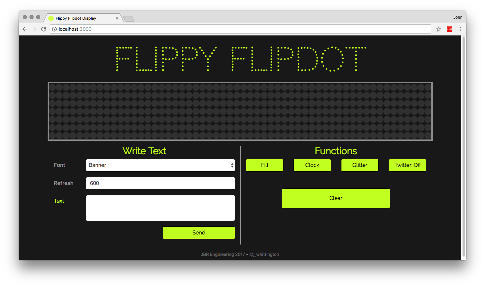

Emulator and GUI for my [Hanover Flipdot Display
driver](https://github.com/tuna-f1sh/node-flipdot)

## Install

```
git clone https://github.com/tuna-f1sh/flippy-flipdot-web
cd flippy-flipdot-web
npm install
node app.js --help
```

## Emulate

```
node app.js --emulate
# Alternatively
npm run emulate
```

## Debug

Pre-append `DEBUG=flipdot*,ascii*` to run commands, eg:

```
DEBUG=flipdot*,ascii* node app.js -p /dev/ttyUSB0 -r 7 -c 56
```

## Notes

* See the node module for issues: https://github.com/tuna-f1sh/node-flipdot
* The display address must be correct for display attempting to be drive
  (default 0x05 is arbitary and should match internal pot position).
* The display rows and columns should be correct for display attempting to
  drive.
* Set the correct RS485 USB device port with `--port`

Whilst I have designed the code to theoretically scale to any display, it has
not been hardware tested (I only have a 56x7). The
[flipdot-display](https://github.com/tuna-f1sh/node-flipdot) might need some
tweaking - PRs welcome!
